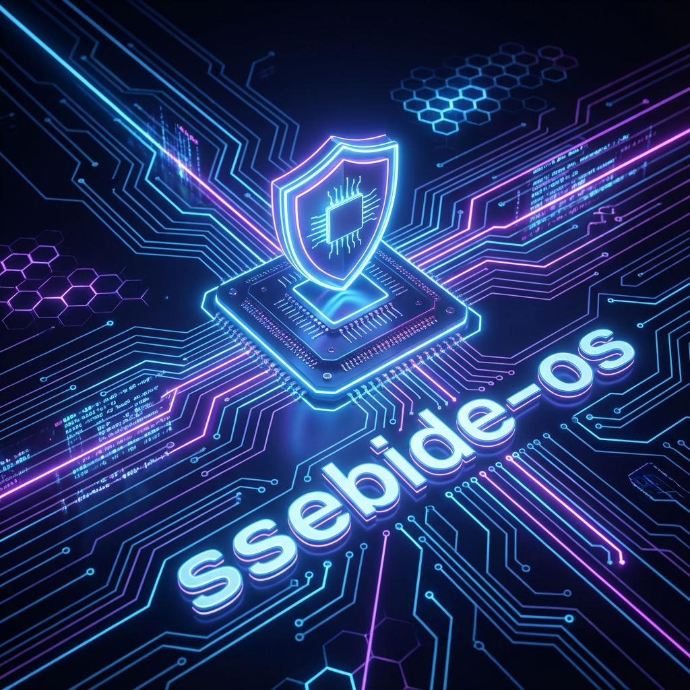

<div align="center">

# ssebide-os

**A simple operating system kernel written in Rust.**

[](https://www.rust-lang.org/)
[](https://github.com/ssebide/ssebide-os)
[](LICENSE)
[](https://en.wikipedia.org/wiki/X86-64)

</div>

---

## 📖 Overview

**ssebide-os** is a custom operating system kernel designed to explore the capabilities of the **Rust** programming language in bare-metal environments. Targeting the **x86_64** architecture, it implements core OS features with a focus on memory safety and concurrency.

## ✨ Features

*   **🖥️ VGA Text Mode**: High-speed, driver-based text output to the screen.
*   **⚡ Interrupt Handling**: Robust IDT implementation for hardware exceptions and interrupts.
*   **🧠 Memory Management**: Advanced paging and heap allocation strategies.
*   **⏱️ Async/Await Support**: Cooperative multitasking with a custom executor.
*   **⌨️ Interactive Input**: PS/2 keyboard driver with scancode decoding.

## 🛠️ Prerequisites

Before you begin, ensure you have the following tools installed:

1.  **Rust Nightly Toolchain**
    ```powershell
    rustup override set nightly
    rustup component add rust-src llvm-tools-preview
    ```

2.  **Bootimage Tool**
    ```powershell
    cargo install bootimage
    ```

3.  **QEMU Emulator**
    *   Download from [qemu.org](https://www.qemu.org/download/).
    *   Add `qemu-system-x86_64` to your system PATH.

## 🚀 Getting Started

### Building the Kernel

Compile the kernel for the custom `x86_64-ssebide-os` target:

```powershell
cargo build
```

### Running the OS

Launch the OS in QEMU with a single command:

```powershell
cargo run
```

> **Note**: This will automatically compile the kernel, create a bootable disk image, and start the QEMU emulator.

## 🧪 Testing

Run the integrated test suite to verify kernel functionality:

```powershell
cargo test
```

## 🤝 Contributing

Contributions are welcome! Please feel free to submit a Pull Request.

1.  Fork the project
2.  Create your feature branch (`git checkout -b feature/AmazingFeature`)
3.  Commit your changes (`git commit -m 'Add some AmazingFeature'`)
4.  Push to the branch (`git push origin feature/AmazingFeature`)
5.  Open a Pull Request

## 📄 License

This project is licensed under the MIT License - see the [LICENSE](LICENSE) file for details.
